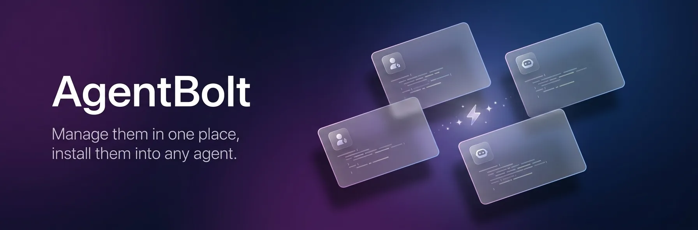

<p align="center">
  
</p>

<p align="center">
  English | <a href="README.ko.md">한국어</a>
</p>

<p align="center">
  <a href="https://www.npmjs.com/package/@tjdals12/agent-bolt"></a>
  <a href="https://www.npmjs.com/package/@tjdals12/agent-bolt"></a>
  <a href="https://github.com/tjdals12/AgentBolt/actions/workflows/ci.yml"></a>
  <a href="LICENSE"></a>
</p>

<p align="center">
  <strong>Manage them in one place, install them into any agent.</strong>
</p>

Juggling several agents like Claude, Codex, and Gemini? Each one stores skills, guidelines, and subagents in a different place and a different format, so you end up keeping the same content in several places at once. And to reuse a skill you've polished in another team or project, you have to copy it over by hand — scattering the files around and leaving every copy to be maintained on its own.

AgentBolt is a CLI that keeps your skills, guidelines, and subagents in one place and installs them into each agent in the format it expects. Maintain a single source, and reuse it as-is across agents, projects, and teams.

## Contents

- [Core Concepts](#core-concepts)
- [Supported agents](#supported-agents)
- [Getting started](#getting-started)
- [How to use](#how-to-use)
- [Creating a catalog](#creating-a-catalog)
- [Project structure](#project-structure)
- [Commands](#commands)
- [License](#license)

## Core Concepts

AgentBolt pulls skills, subagents, and guidelines from a repository outside your project, then converts and installs them into the agents you use. That repository is called a **catalog**, the skills, subagents, and guidelines are called **items**, and a set of related items grouped together is called a **package**.

### Catalog

A repository that holds your items. It can live in a local directory or a Git repository. Keeping the catalog outside your project — rather than inside it — lets you manage well-crafted items in one place and share them across projects and teams. Pushing it to a Git repository also gives you version history and lets a whole team work from the same catalog.

### Package

A group of items bundled together. You're free to decide how to group them: you might bundle items used in the same workflow — like writing commits and opening PRs — into a `git-workflow` package, or group the items a particular team shares by team. Either way, you can pull in a whole package at once instead of picking items one by one.

### Item

A skill, subagent, or guideline that gets installed into an agent. Skill and subagent are the same terms the agents already use; a guideline is the project instructions you'd write in a file like `CLAUDE.md` or `AGENTS.md`.

Skills and subagents install the same way into every agent, but guidelines depend on what each agent supports. If an agent has a dedicated rules concept (like Claude Code's `.claude/rules/`), each guideline is installed there as its own file. Otherwise, guidelines are collected into a managed block inside the agent's instructions file.

In Codex's `AGENTS.md`, for example, it looks like this:

```markdown
# AGENTS.md

<!-- bolt:start -->
<!--
Generated by agent-bolt. Do not edit this block manually.
Run `agent-bolt sync` to update it.
-->

... your selected guidelines ...

<!-- bolt:end -->
```

If the instructions file (e.g. `AGENTS.md`) doesn't exist yet, AgentBolt creates it. If it already exists, AgentBolt looks for these markers and updates only what's between them — so add the `<!-- bolt:start -->` and `<!-- bolt:end -->` markers yourself, wherever you want the guidelines to go.

## Supported agents

AgentBolt installs each item into the location its target agent expects.

| Agent          | `--tools` | Skills            | Subagents         | Guidelines                  |
| -------------- | --------- | ----------------- | ----------------- | --------------------------- |
| Claude Code    | `claude`  | `.claude/skills/` | `.claude/agents/` | `.claude/rules/`            |
| Codex          | `codex`   | `.codex/skills/`  | `.codex/agents/`  | `AGENTS.md` (managed block) |
| Cursor         | `cursor`  | `.cursor/skills/` | `.cursor/agents/` | `.cursor/rules/`            |
| GitHub Copilot | `copilot` | `.github/skills/` | `.github/agents/` | `.github/instructions/`     |

## Getting started

**Requires Node.js 24 or later.**

Install AgentBolt globally.

```bash
npm install -g @tjdals12/agent-bolt
```

Move into your project directory and initialize.

```bash
cd your-project
agent-bolt init
```

Running `init` lets you pick the agents to use and add a catalog. For the agents you can choose and their `--tools` values, see [Supported agents](#supported-agents).

A catalog can live in a local directory or a Git repository.

| Type            | `--source` example                             |
| --------------- | ---------------------------------------------- |
| Local directory | `dev=local:./catalog`                          |
| Git repository  | `team=git:https://github.com/acme/catalog.git` |

For how to pick items from a catalog and install them after initializing, see [How to use](#how-to-use) below.

## How to use

AgentBolt pulls items from a catalog and installs them into your agents. Here's the flow, from choosing a catalog through installing and checking it.

### Set up a catalog

A catalog can live in a local directory, or be pushed to a Git repository to share with your team. To build one yourself, see [Creating a catalog](#creating-a-catalog).

If you're just getting started, you can jump right in with an [existing catalog](https://github.com/tjdals12/AgentBoltCatalog.git).

```bash
agent-bolt init --tools=claude,codex,cursor,copilot --source common=git:https://github.com/tjdals12/AgentBoltCatalog.git
```

### Browse the catalog

Use `list-packs` to see the packages a catalog offers.

```text
$ agent-bolt list-packs

▌ Agent Bolt: Catalog packs

▸ common  (local)

  📦 backend
     Skills specialized for NestJS/Prisma backend development.
     🔧 2 skills  🤖 2 agents  📋 6 guidelines

  ...
```

Use `list-items` to see the items (skills, subagents, guidelines) in a given package.

```text
$ agent-bolt list-items --packs=common

▌ Agent Bolt: Catalog items

  📦 common

    🔧 4 skills
         clean-code
           Apply Robert C. Martin's Clean Code principles ...
         ...
    🤖 8 agents
         ...
    📋 3 guidelines
         ...
```

Use `show-item` to inspect a single item's contents and configuration in detail.

```text
$ agent-bolt show-item --source=common --pack=common --item=create-commit

▌ Agent Bolt: Catalog item

🔧 create-commit
  common/common · skill

description
  Generate Conventional Commits messages, stage changes if needed, ...

instructions
  # Create Commit
  ...
```

### Select packages and items

Use `add-pack` to add every item in a package.

```text
$ agent-bolt add-pack --source=common --packs=common

▌ Agent Bolt: Added 1 pack to common

+ 📂 common   🔧 4 skills  🤖 8 agents  📋 3 guidelines
...
```

Use `add-item` to add just specific items from a package.

```text
$ agent-bolt add-item --source=common --pack=backend --skills=nestjs-expert

▌ Agent Bolt: Added 1 item to common/backend
  (created pack backend in common)

  + 🔧 nestjs-expert
...
```

Use `remove-pack` and `remove-item` to drop packages or items you've added.

```text
$ agent-bolt remove-item --source=common --pack=common --skills=pr-review

▌ Agent Bolt: Removed 1 item from common/common

  - 🔧 pr-review
...
```

These commands only edit your config file. The actual installation happens with `sync`.

### Install into your agents

Running `sync` converts the items in your config into each agent's format and installs them.

```text
$ agent-bolt sync

▌ Agent Bolt: Sync complete

Claude Code   🔧 3 skills  🤖 8 agents  📋 3 guidelines
  + 14 installed
    common/clean-code, common/create-commit, ...

Codex   🔧 3 skills  🤖 8 agents  📋 3 guidelines
  + 12 installed
    common/clean-code, common/create-commit, ...

26 installed
```

Files are installed wherever each agent expects to find them.

```text
your-project/
├── .claude/
│   ├── skills/
│   │   ├── bolt-common-common-create-commit/
│   │   │   └── SKILL.md
│   │   └── ...
│   ├── agents/
│   │   ├── bolt-common-common-code-reviewer.md
│   │   └── ...
│   └── rules/
│       ├── bolt-common-common-commit-rules.md
│       └── ...
├── .cursor/
│   ├── skills/
│   │   ├── bolt-common-common-create-commit/
│   │   │   └── SKILL.md
│   │   └── ...
│   ├── agents/
│   │   ├── bolt-common-common-code-reviewer.md
│   │   └── ...
│   └── rules/
│       ├── bolt-common-common-commit-rules.mdc
│       └── ...
├── .codex/
│   ├── skills/
│   │   ├── bolt-common-common-create-commit/
│   │   │   └── SKILL.md
│   │   └── ...
│   └── agents/
│       ├── bolt-common-common-code-reviewer.toml
│       └── ...
├── .github/
│   ├── skills/
│   │   ├── bolt-common-common-create-commit/
│   │   │   └── SKILL.md
│   │   └── ...
│   ├── agents/
│   │   ├── bolt-common-common-code-reviewer.agent.md
│   │   └── ...
│   └── instructions/
│       ├── bolt-common-common-commit-rules.instructions.md
│       └── ...
└── AGENTS.md   # Codex guidelines accumulate in a managed block
```

### Check installation status

`check` inspects what's installed and reports anything that has drifted from your config file.

```text
$ agent-bolt check

▌ Agent Bolt: Drift detected

Claude Code   🔧 4 skills  🤖 1 agent  📋 1 guideline
  + 1 missing
    backend/nestjs-expert
  ~ 1 drifted
    common/create-commit
  - 1 orphaned
    common/pr-review

Codex   🔧 4 skills  🤖 1 agent  📋 1 guideline
  + 1 missing
    backend/nestjs-expert
  - 1 orphaned
    common/pr-review

2 missing · 1 drifted · 2 orphaned
...
```

**Note:** If anything has drifted, the command exits with code 1 (`process.exitCode = 1`). Add it to CI to keep drifted installations from being merged.

Here's what each marker in the output means:

| Marker | State    | Meaning                                             |
| ------ | -------- | --------------------------------------------------- |
| `+`    | missing  | In your config file but not installed yet           |
| `~`    | drifted  | Installed, but its contents differ from the catalog |
| `-`    | orphaned | Removed from your config file but still installed   |

## Creating a catalog

AgentBolt ships `catalog` commands for building and managing catalogs.

The fastest way to start is from the [AgentBoltCatalogTemplate](https://github.com/tjdals12/AgentBoltCatalogTemplate) repository — use it as a template to get a ready-made layout, then fill in your own packs and items. To build one from scratch, follow the steps below.

### Create a catalog directory

Create an empty directory to use as your catalog.

```bash
mkdir acme-catalog && cd acme-catalog
```

### Initialize the catalog

Use `catalog init` to turn the directory into a catalog. It creates the manifest (`catalog.json`) and the package scaffold (`packs/`).

```text
$ agent-bolt catalog init --name=acme-catalog --description="Team shared assets"

▌ Agent Bolt: Catalog initialized

name:        acme-catalog
description: Team shared assets
location:    .

  + catalog.json
  + packs/
...
```

### Create a package

Use `catalog new-pack` to create a package. It creates the package directory and its manifest (`pack.json`).

```text
$ agent-bolt catalog new-pack git-workflow --description="Commit and PR helpers"

▌ Agent Bolt: Created pack git-workflow

name:        git-workflow
description: Commit and PR helpers
location:    .

  + packs/git-workflow/
  + packs/git-workflow/pack.json
...
```

### Create items

Use `catalog new-skill`, `new-agent`, or `new-guideline` to create items. Each one creates the manifest and files for its type; edit those files to flesh the item out.

```text
$ agent-bolt catalog new-skill create-commit --pack=git-workflow

▌ Agent Bolt: Created skill create-commit

name:        create-commit
pack:        git-workflow
description: TODO: describe this item
location:    .

  + packs/git-workflow/skills/create-commit/
  + packs/git-workflow/skills/create-commit/skill.json
  + packs/git-workflow/skills/create-commit/instructions.md
...
```

### Validate the catalog

Use `catalog validate` to check the catalog — that manifests match the schema, that body and asset files are all present, that names line up with their directories, and so on.

```text
$ agent-bolt catalog validate

▌ Agent Bolt: Catalog valid

1 pack   🔧 1 skill  🤖 0 agents  📋 0 guidelines

no problems found
```

**Note:** If it finds problems, the command exits with code 1 (`process.exitCode = 1`). Add it to CI to keep a broken catalog from being merged.

### (Optional) Share via Git

To share with your team, push the catalog to a Git repository.

```bash
git init
git add .
git commit -m "Add catalog"
git remote add origin <repo-url>
git push -u origin main
```

## Project structure

Initializing AgentBolt in a project creates an `.agent-bolt/` directory.

It holds two files:

- **catalog-config.yml** — the config file that declares which items, from which catalogs, get installed into which agents. You can edit it by hand, but managing it through AgentBolt's commands is recommended.
- **install-lock.json** — records the current installation state. It's created and updated when you run `sync`, and both `sync` and `check` read it afterward to determine what's installed.

### catalog-config.yml

```yaml
version: 1

# Agents to install items into
tools:
  - claude
  - codex

# Catalogs to pull items from
sources:
  common:
    # local: a local directory / git: a Git repository
    type: local
    # Path to the catalog directory
    path: ./catalog
  team:
    type: git
    # Git repository URL
    url: https://github.com/acme/catalog.git
    # (optional) branch or tag (default: the repo's default branch)
    ref: main
    # (optional) when the catalog lives in a subdirectory of the repo
    subdir: catalog

# Packages and items to install (source alias → package → items by type)
packs:
  common:
    git-workflow:
      # skills to add
      skills:
        - create-commit
        - create-pr
      # agents to add
      agents:
        - code-reviewer
      # guidelines to add
      guidelines:
        # always: applied at all times
        commit-rules:
          load: always
        # conditional: applied only to files matching the glob
        react-conventions:
          load: conditional
          glob:
            - src/**/*.tsx
```

## Commands

### `agent-bolt init`

Sets up AgentBolt in your project. Run it with no options to go through it interactively.

```text
agent-bolt init [options]
```

| Option            | Description                                                                          | Required | Default            |
| ----------------- | ------------------------------------------------------------------------------------ | -------- | ------------------ |
| `--tools <list>`  | Agents to install items into. Comma-separated (e.g. `claude,codex,cursor,copilot`)   | Optional | Interactive prompt |
| `--source <spec>` | Catalog to pull items from. `<alias>=<type>:<location>` (e.g. `dev=local:./catalog`) | Optional | Interactive prompt |
| `--force`         | Overwrite an existing config file                                                    | Optional | —                  |

### `agent-bolt list-packs`

Lists the packages a catalog offers.

```text
agent-bolt list-packs [options]
```

| Option             | Description     | Required | Default      |
| ------------------ | --------------- | -------- | ------------ |
| `--source <alias>` | Catalog to list | Optional | All catalogs |

### `agent-bolt list-items`

Lists items grouped by package.

```text
agent-bolt list-items [options]
```

| Option             | Description                       | Required | Default      |
| ------------------ | --------------------------------- | -------- | ------------ |
| `--source <alias>` | Catalog to list                   | Optional | All catalogs |
| `--packs <list>`   | Packages to list. Comma-separated | Optional | All packages |

### `agent-bolt show-item`

Shows the body, configuration, and assets of a single item in detail.

```text
agent-bolt show-item --source <alias> --pack <name> --item <name> [options]
```

| Option             | Description                 | Required | Default |
| ------------------ | --------------------------- | -------- | ------- |
| `--source <alias>` | Catalog the item belongs to | Required | —       |
| `--pack <name>`    | Package the item belongs to | Required | —       |
| `--item <name>`    | Name of the item to show    | Required | —       |

### `agent-bolt add-pack`

Adds an entire package to your config.

```text
agent-bolt add-pack --source <alias> --packs <list>
```

| Option             | Description                               | Required | Default |
| ------------------ | ----------------------------------------- | -------- | ------- |
| `--source <alias>` | Target catalog                            | Required | —       |
| `--packs <list>`   | Names of packages to add. Comma-separated | Required | —       |

### `agent-bolt add-item`

Adds specific items to your config. Creates the package entry if it doesn't exist yet.

```text
agent-bolt add-item --source <alias> --pack <name> [options]
```

| Option                | Description                                 | Required | Default |
| --------------------- | ------------------------------------------- | -------- | ------- |
| `--source <alias>`    | Target catalog                              | Required | —       |
| `--pack <name>`       | Target package                              | Required | —       |
| `--skills <list>`     | Names of skills to add. Comma-separated     | Optional | —       |
| `--agents <list>`     | Names of subagents to add. Comma-separated  | Optional | —       |
| `--guidelines <list>` | Names of guidelines to add. Comma-separated | Optional | —       |

### `agent-bolt remove-pack`

Removes an entire package from your config.

```text
agent-bolt remove-pack --source <alias> --packs <list>
```

| Option             | Description                                  | Required | Default |
| ------------------ | -------------------------------------------- | -------- | ------- |
| `--source <alias>` | Target catalog                               | Required | —       |
| `--packs <list>`   | Names of packages to remove. Comma-separated | Required | —       |

### `agent-bolt remove-item`

Removes specific items from your config.

```text
agent-bolt remove-item --source <alias> --pack <name> [options]
```

| Option                | Description                                    | Required | Default |
| --------------------- | ---------------------------------------------- | -------- | ------- |
| `--source <alias>`    | Target catalog                                 | Required | —       |
| `--pack <name>`       | Target package                                 | Required | —       |
| `--skills <list>`     | Names of skills to remove. Comma-separated     | Optional | —       |
| `--agents <list>`     | Names of subagents to remove. Comma-separated  | Optional | —       |
| `--guidelines <list>` | Names of guidelines to remove. Comma-separated | Optional | —       |

### `agent-bolt sync`

Installs the items in your config into each agent.

```text
agent-bolt sync
```

### `agent-bolt check`

Checks whether what's installed has drifted from your config file. Exits with code 1 if it has.

```text
agent-bolt check
```

The following `catalog` commands are for authoring catalogs.

### `agent-bolt catalog init`

Creates the manifest (`catalog.json`) and the package scaffold (`packs/`).

```text
agent-bolt catalog init [options]
```

| Option                 | Description         | Required | Default           |
| ---------------------- | ------------------- | -------- | ----------------- |
| `--dir <dir>`          | Catalog directory   | Optional | Current directory |
| `--name <name>`        | Catalog name        | Optional | Directory name    |
| `--description <text>` | Catalog description | Optional | `"TODO: ..."`     |

### `agent-bolt catalog new-pack`

Creates the manifest (`pack.json`) and the package scaffold (`<pack-name>/`).

```text
agent-bolt catalog new-pack <name> [options]
```

| Option                 | Description         | Required | Default           |
| ---------------------- | ------------------- | -------- | ----------------- |
| `--dir <dir>`          | Catalog directory   | Optional | Current directory |
| `--description <text>` | Package description | Optional | `"TODO: ..."`     |

### `agent-bolt catalog new-skill · new-agent · new-guideline`

Creates the manifest and the item scaffold (`<type>/<name>/`).

```text
agent-bolt catalog new-skill <name> --pack <name> [options]
agent-bolt catalog new-agent <name> --pack <name> [options]
agent-bolt catalog new-guideline <name> --pack <name> [options]
```

| Option                 | Description                 | Required | Default           |
| ---------------------- | --------------------------- | -------- | ----------------- |
| `--pack <name>`        | Package the item belongs to | Required | —                 |
| `--dir <dir>`          | Catalog directory           | Optional | Current directory |
| `--description <text>` | Item description            | Optional | `"TODO: ..."`     |

### `agent-bolt catalog validate`

Checks the catalog's structure, manifests, and integrity. Exits with code 1 if it finds problems.

```text
agent-bolt catalog validate [options]
```

| Option        | Description       | Required | Default           |
| ------------- | ----------------- | -------- | ----------------- |
| `--dir <dir>` | Catalog directory | Optional | Current directory |

## License

Released under the MIT License. See [LICENSE](LICENSE) for the full text.
